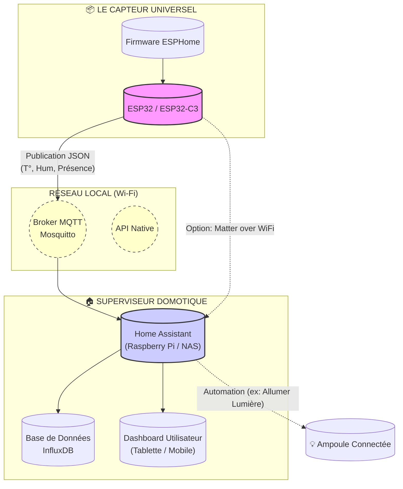

# AVIGNON UNIVERSITÉ | LICENCE PRO SN DOC
**La Salle Avignon – Frères des Écoles Chrétiennes**

---

# 🏠 FICHE PROJET 2026 : CAPTEUR DOMOTIQUE UNIVERSEL (MATTER/MQTT)

**Date :** 05 Décembre 2025
**Statut :** Lancement Officiel
**Technologie clé :** ESPHome / Home Assistant / Matter

## 1. Composition de l'Équipe
Ce projet est attribué au groupe de travail suivant :
* **Mathis MARTIN** 
* **Mathieu REGE** 
* **Yassin TIGHEGHT** 
* **Steven ROBERT**

---

## 2. Présentation générale du système

### Contexte : Le chaos de la maison connectée
Dans un monde de plus en plus connecté, la domotique souffre d'un problème majeur : la fragmentation. Chaque marque a son application et ses protocoles propriétaires.
Ce projet vise à résoudre ce problème en créant un "Couteau Suisse" de la maison connectée : un boîtier unique, ouvert et standardisé.

### Objectif du Projet
Développer un capteur multifonction design et discret, capable de remonter un maximum d'informations environnementales (Qualité d'air, Présence, Bruit) vers un système central de type **Home Assistant**.
Le maître-mot est **l'interopérabilité**. Le capteur ne doit pas dépendre d'un cloud propriétaire chinois ou américain, mais parler des langages standards : **MQTT** (le standard actuel) et **Matter** (le standard du futur).

### Innovation 2026 : Le "Multi-Sensing" & Matter
Contrairement aux capteurs simples du marché, ce dispositif combinera :
1.  **Analyse d'air complète** (CO2, COV, Température, Humidité).
2.  **Détection de présence avancée** (Radar mmWave) capable de détecter une personne immobile (respiration), là où les capteurs infrarouges (PIR) échouent.
3.  **Compatibilité Matter (Bonus Expert) :** Rendre l'objet détectable nativement par Apple HomeKit ou Google Home sans passerelle complexe.

---

## 3. Synoptique et Architecture Technique

### A. Architecture de Communication (Flux de données)
Le système repose sur une communication bidirectionnelle entre le capteur (ESP32) et le superviseur (Home Assistant).

### B. Diagramme Fonctionnel (Architecture Interne)
Détail des composants embarqués dans le boîtier et de leur interaction avec le microcontrôleur.

---

## 4. Fonctionnalités & Cahier des Charges

### A. Le "Multi-Sensing" (Acquisition) 🕵️
Le boîtier doit intégrer et gérer les capteurs suivants :
* **Qualité d'Air :** Mesure du CO2 (NDIR recommandé pour la précision) ou des COV (Composés Organiques Volatils) + Température/Humidité (BME680 ou SHT40).
* **Présence Humaine (Radar) :** Utilisation d'un capteur radar à ondes millimétriques (mmWave - type LD2410) pour détecter la présence statique (lecture, sommeil).
* **Luminosité :** Capteur de Lux pour automatiser l'ouverture/fermeture des volets.

### B. Communication & Dashboard
* **Protocole principal :** MQTT (Message Queuing Telemetry Transport) via Wi-Fi.
* **Firmware :** **ESPHome** est recommandé pour "dégrossir" le projet et valider le hardware rapidement. Toutefois, si l'option **Matter** est activée, il faudra remplacer ESPHome par un développement en C++ natif (Espressif Matter SDK) pour une implémentation complète.
* **Supervision :** Création d'un tableau de bord (Dashboard) sur Home Assistant affichant les graphiques historiques (Qualité d'air sur 24h).

### C. Design & Intégration
* Le boîtier (Impression 3D) doit être conçu pour permettre un flux d'air suffisant (pour le capteur de température) tout en étant esthétique pour un salon.
* **Circuit Imprimé (PCB) :** Conception et réalisation d'un PCB sur mesure (Kicad/EasyEDA) pour professionnaliser le prototype et éliminer les câbles volants.

---

## 5. Ressources & Inspiration (Bibliographie Technique)

L'équipe devra s'appuyer sur les références suivantes :
* **Le Benchmark (Modèle à suivre) :**
    * *Everything Presence One* : Le projet commercial issu de la communauté DIY qui sert de référence absolue.
* **Outils & Documentation :**
    * *ESPHome Documentation* : La bible pour configurer les capteurs sans réinventer la roue.
    * *Home Assistant* : Le superviseur domotique open-source.
* **Conception PCB :**
    * *KiCad Like a Pro (DigiKey)* : Série de tutoriels vidéo indispensable pour apprendre à router un circuit imprimé proprement.
* **Le Standard Matter :**
    * *ESP32 Matter Tutorial (Espressif)* : Documentation officielle pour transformer un ESP32 en périphérique Matter.

---

## 6. Jalons & Livrables Spécifiques 2026

| Date | Jalon | Livrable Technique Attendu |
| :--- | :--- | :--- |
| **10 Février** | **Jalon 1 (Spécifications)** | **POC MQTT.** Le microcontrôleur (sur breadboard) envoie des données simulées ou réelles (ex: température) qui s'affichent en temps réel sur un serveur Home Assistant local. |
| **14 Avril** | **Jalon 2 (Mi-parcours)** | **Prototype & Typon.** Tous les capteurs fonctionnent ensemble. Le dashboard est actif. Le routage du PCB est terminé et prêt pour fabrication. |
| **19 Juin** | **Soutenance Finale** | **Produit Fini.** Démonstration du capteur final sur PCB soudé, intégré dans son boîtier. Scénario domotique actif (ex: "Si présence détectée ET luminosité faible ALORS allumer lumière sur le dashboard"). |

---

## 7. Critères d'Évaluation Spécifiques

1.  **Stabilité :** Le capteur ne doit pas se déconnecter du Wi-Fi et doit gérer les reconnexions automatiques.
2.  **Précision du Radar :** Capacité à bien régler la sensibilité du mmWave pour éviter les faux positifs (détecter un ventilateur qui tourne) et les faux négatifs.
3.  **Interopérabilité :** La facilité d'intégration dans un système tiers (Home Assistant ou autre) via MQTT autodiscovery.
